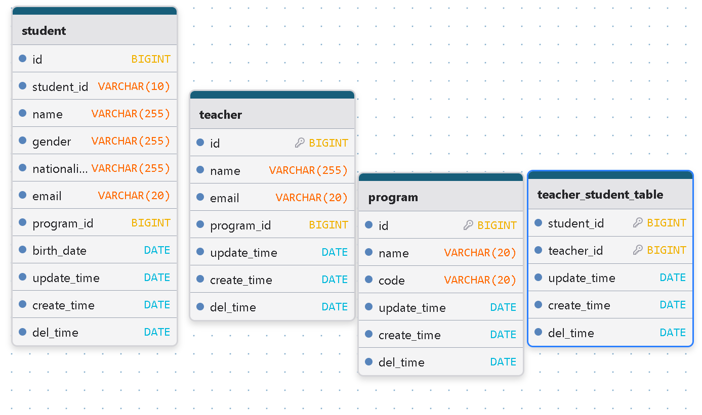

Project scope

This database supports the records of YB College. It save information about students, teachers, and programs, and manages the relationships between them. The goal is to maintain clean records of who studies in which program and which teachers supervise which students.

Story

when new student join our school, our personal information and major will be save in the database. And the information of teachers also will be saved. Program describe a study field. For example software engineer. The database also save the relate in teacher and student for the study.

Entities and EER diagram

Student: save each student’s ID, personal details (name, gender, nationality, email, birth date), and the program they belong to.
Teacher:   save each teacher’s ID, name and email
Program: save the program's name and code
teacher_student_table: A relationship table linking students and teachers

program(Major) -> student 1->N

program(Major) -> teacher M->N

student -> teacher M->N

