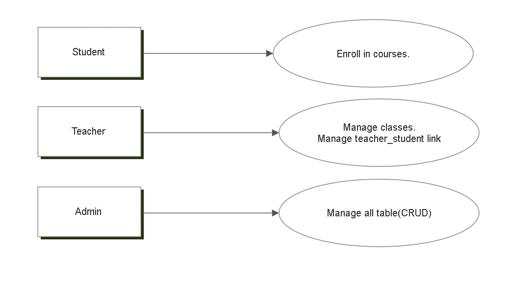

This project is a tiny student-records system for YB College. 
It stores Students, Teachers, Programs, and the links between teachers and students. 
Students can browse the program/course list and enroll. 
Teachers manage their classes and maintain the teacher-student advising relation. 
Admin maintains the catalog (programs/courses) and user records. 
The goal is to keep clean relationships: which student studies in which program, 
and which teacher supervises which student.

Key Use Cases

Student: Enroll in Course

Teacher: Create/Update Class (section), Manage Teacher-Student Link (advisor/mentor)

Admin: Manage Program

Scenario 1 Student enrolls in course
1. open the course catalog
2. view the detail of course
3. click enroll
4. check the information (conflicts)
5. add the information to course

Scenario 2 Teacher manages teacher_student link
1. open teacher_students link
2. search student and choose the relate(advisor/mentor)
3. update information

Scenario 3 Admin maintains program
1. add/update program(name code)
2. create the teacher_program relate information
3. create successful
